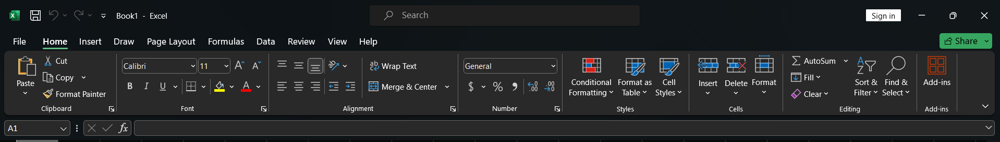
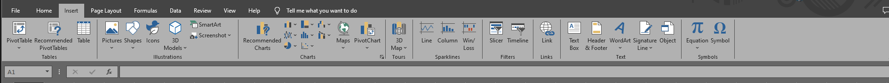
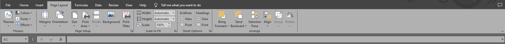
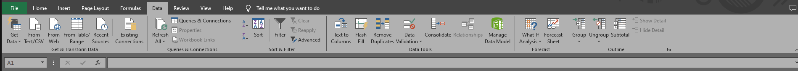

# Excel Basics

## The Ribbon

The ribbon in Excel is where you will find the majority of options to edit the worksheet. The ribbon looks like this: 

The home tab largely covers the formatting of text and other parts of the workbook. You will most likely stay on this tab of the ribbon most often when working with Excel. The home tab is split into several sections, called groups. The clipboard group covers commands related to copying and pasting text into the workbook. The font group covers the themeing of text, which we will cover in a later section. The Alignment group involves the placement of text within a cell and how the text is aligned. The number group changes the formatting that numbers take, for example, adding a $ to prices or turning 121912 into 12/19/12. Styles and Cells cover ways to format the cells directly, not the text they contain. The editing tab contains some commonly used functions to make your life easier when working with Excel. 

### Insert

The insert tab largely covers functions related to inserting charts and other decorative items to a worksheet. The insert tab is broken down into smaller groups that all serve a similar purpose, the addition of an item to the worksheet. Pictures, Shapes, Icons, Models, Charts, Sparklines, Filters, Links, Text, and Symbols are all examples of items that can be added to a workbook from within this section. 

### Page Layout

The page layout menu covers functions related to formatting the workbork for printing. Within this section of the ribbon, you can adjust the margin, orientation, size, and area that will be printed when you print off the workbork. This section will be most useful when you need to print off a copy of work your work onto physical paper. 

### Data

The data menu largely covers the inclusion of data from other sources and filtering the existing data. Using this menu, you can import data into the workbook from external sources (local/web) or from another workbook. The other groups on this bar can help you sort and filter this data to make sure it's laid out optimally and does not contain junk data. 

## Rows and columns

The boxes (cells) in excel are divided into **2** positional names. Rows and Columns. Rows are assigned a name by their *number* on the left hand side. Columns are assigned a *letter* from the top of the view. Knowing this is important, because you will be frequently using ranges like A16:D34 when editing tables. 

## Navigation

When navigating Microsoft Excel, you can use either the mouse to click from cell to cell, or use the arrow keys. 

## Charts & Tables
Charts and Tables are designed to give the user a unique view of the data you've entered in your workbook. This can be stylised in many ways using the design tab that appears when you create a chart or table. 
## Working with text
>Text can be customised in several ways, most commonly by: 
>- Font
>- Text Size
>- Color

# Formulas
Formulas are a very powerful tool in excel. This is where the most skill expression can be shown. I will only be covering the basics of formulas here, but I highly encourage to look into what these tools can do if you're using it in the workplace. 

## SUM
Sum is a formula that will return a value that from adding up all the numbers in the provided range.
## AVERAGE
Sum is a formula that will return a value that from averaging all the numbers in the provided range.
## COUNT
Count will return the numbers of cells in a range, this can be useful when working with large workbooks that have multiple sets of data. 
## MOD
This function will return the remainder of a number after division
## POWER
This function handles raising a number to an exponential power, this can be useful when calculating interest for example. 
## CEILING
This function is responsible for rounding up a number to the most relevant digit, for example, it will round 34.5123 to 35. 
## FLOOR
This function is responsible for rounding down a number to the most relevant digit, for example, it will round 34.5123 to 34. 
## LEN
This function returns the length of the text in the cell selected
## TODAY
This will return the current sytem date. 
# Advanced Excel
> [I built my own 16-Bit CPU in Excel!](https://www.youtube.com/watch?v=5rg7xvTJ8SU)

In this video the creator was able to create a fully functioning cpu using only Microsoft Excel. I chose this to showcase because I think it is extremely interesting and lines up really well with my major. The CPU may only have 16 bits of addressable space, but it operates entirely in excel except for the user acting as an external clock generator. 